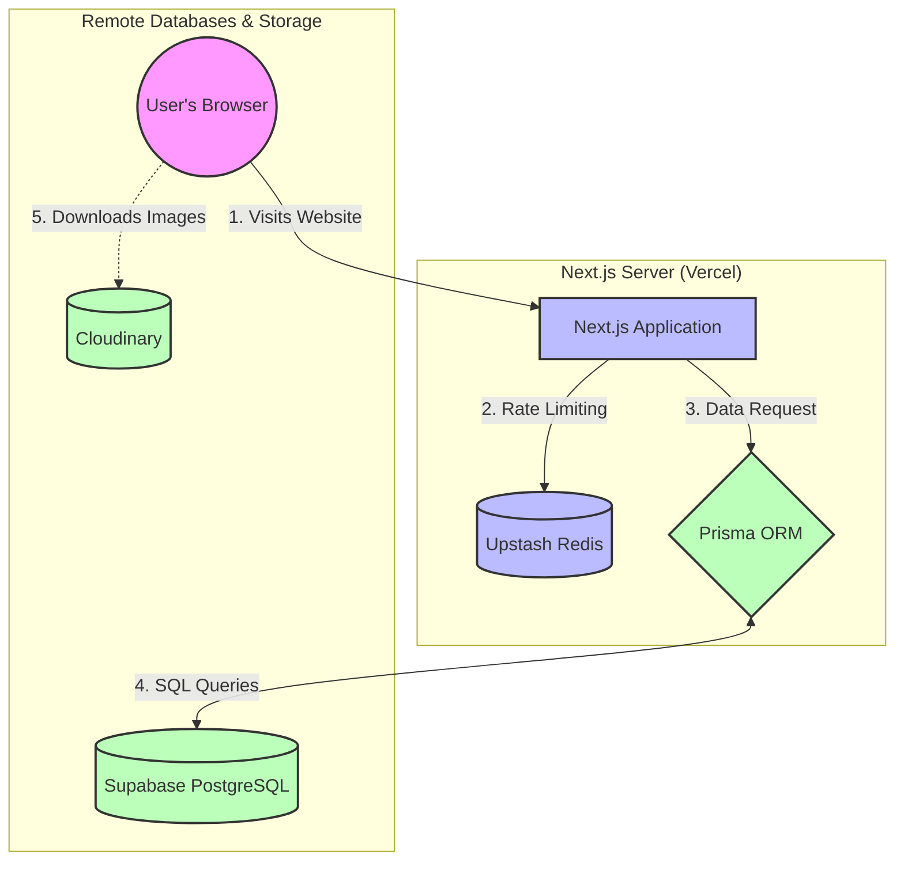

# Beginner's Guide: Understanding the EArovers Architecture

Welcome to the EArovers project! If you are new to modern web development or haven't used the specific tools in our stack before, this document is for you. 

We’ve built this project using a "modern stack" that might seem complex at first, but every tool was chosen to solve a specific problem. By the end of this guide, you’ll understand what each tool does, why we use it, and how they all connect together.

---

## 1. The Big Picture: How Our App Works

When a user visits our website, a few different services work together behind the scenes:
1. **Next.js (React)**: The framework that builds the user interface (what the user sees) and handles server requests.
2. **Supabase**: Our remote database host (stores our data).
3. **Prisma**: The translator that helps Next.js talk to Supabase easily.
4. **Cloudinary**: A specialized storage service for holding our images and videos.
5. **Upstash Redis**: A high-speed memory cache used to protect our site from spam (rate limiting).

Let's break down each one.

### Visual Architecture Diagram

---

## 2. The Database: Supabase + Prisma

### What is Supabase?
Normally, if you want a database, you have to rent a server, install a database system like PostgreSQL, configure security, and maintain it. **Supabase** does all of this for us in the cloud. It provides us with a hosted PostgreSQL database and built-in user authentication (login/signup). 
- *Think of it as:* A giant, secure, cloud-based Excel spreadsheet where all our user and clan data lives.

### What is Prisma?
Databases speak a language called SQL (Structured Query Language). Writing raw SQL inside JavaScript code can be messy and error-prone. **Prisma** is an Object-Relational Mapper (ORM). It reads a single file (`prisma/schema.prisma`) that defines what our data looks like, and then it generates simple JavaScript functions so we can interact with the database without writing SQL.
- *Think of it as:* A universal translator. We write simple JavaScript (`prisma.member.findMany()`), and Prisma translates it into complex SQL to fetch data from Supabase.

**How they connect:** Next.js uses Prisma to ask Supabase for data. Supabase sends the data back, and Next.js displays it on the screen.

**Resources to learn:**
- [Prisma in 100 Seconds (Video)](https://www.youtube.com/watch?v=E7VJos7xEcg)
- [Prisma Quickstart Guide](https://www.prisma.io/docs/getting-started)
- [Supabase Crash Course](https://www.youtube.com/watch?v=7uKQBl9uZ00)

---

## 3. Media Storage: Cloudinary

### What is Cloudinary?
You might wonder: *"If we have a Supabase database, why don't we just save our images there?"*
Databases are great for text and numbers, but they are terrible at storing heavy files like images and videos. It makes the database bloated, slow, and expensive. 

**Cloudinary** is a cloud service designed specifically for hosting images. When a user uploads a photo, it goes directly to Cloudinary. Cloudinary then gives us a simple URL (link) to that image. 

**How it connects to Prisma:**
We take the URL that Cloudinary gives us and save *just the URL string* in our Supabase database using Prisma (in the `Media` model). When the website loads, it reads the URL from the database and tells the browser to fetch the actual image from Cloudinary.

**Resources to learn:**
- [Cloudinary Fundamentals](https://cloudinary.com/documentation/cloudinary_get_started_tutorial)

---

## 4. Speed & Security: Caching and Redis

If 1,000 users visit our site at the exact same time, asking the database for information 1,000 times will crash the database or cost us a lot of money. We solve this using two caching techniques:

### Next.js ISR (Incremental Static Regeneration)
Instead of asking the database for data every single time a user opens a page (like `/shields` or `/fame`), Next.js asks the database *once*, builds the HTML page, and saves it. For the next 60 seconds, anyone who visits gets the saved (cached) page instantly. After 60 seconds, Next.js will quietly ask the database for updates in the background.
- *Why we use it:* It makes the website incredibly fast and keeps our database bills at zero.

### Upstash Redis (Rate Limiting)
**Redis** is a database that stores data in RAM (memory) instead of a hard drive, making it lightning fast. We use a serverless version of it called **Upstash**.
We use Redis inside our Next.js Middleware (`src/proxy.ts`) to count how many times a user refreshes the page or tries to log in. If they try too many times in a row, Redis blocks them.
- *Why we use it:* It protects our app from hackers trying to brute-force passwords or bots trying to crash our site (DDoS attacks).

**Resources to learn:**
- [Next.js Data Fetching & Caching](https://nextjs.org/docs/app/building-your-application/data-fetching/fetching-caching-and-revalidating)
- [What is Redis?](https://redis.io/docs/about/)

---

## 5. The Complete Flow: How a Request Works

Let's look at what happens when a user navigates to the `/shields` page:

1. **The Request:** The user clicks the "Shields" button.
2. **The Cache Check (Next.js ISR):** Next.js checks if it has a saved version of the `/shields` page from the last 60 seconds. 
   - If *yes*, it sends it to the user instantly.
   - If *no*, it moves to step 3.
3. **The Database Query (Prisma):** Next.js runs `prisma.shield.findMany()` in a Server Component.
4. **The Database (Supabase):** Prisma connects to Supabase, executes the SQL, and gets the list of shields.
5. **The Media:** The database returns the text data, including the image URLs (which are hosted on Cloudinary).
6. **The Render:** Next.js builds the page with this data and sends it to the user.

---

## 6. How You Can Start Contributing

If you are writing code for this project, here is the golden rule: **Don't hardcode data.** 

If you need a new list of items, a new page of members, or a new gallery:
1. **Update the Database:** Add your new data structure to `prisma/schema.prisma` and run `npx prisma db push`.
2. **Add Data:** Go to your Supabase dashboard online and type in your data, or build an admin form.
3. **Fetch Data:** In your Next.js page, import `prisma` and use `await prisma.yourModel.findMany()` to get the data.
4. **Cache It:** Add `export const revalidate = 60;` to the top of your page file.

For more practical coding examples on how to do this in our codebase, read the [`docs/DEVELOPER_GUIDE.md`](./DEVELOPER_GUIDE.md) file!
